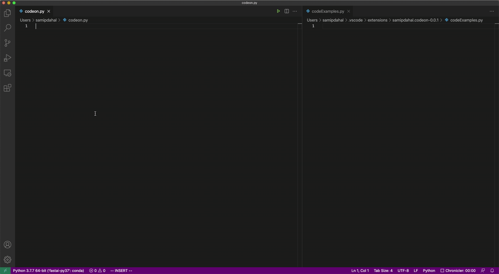

# codeon

A code generation system augmented with code search. Code search is done over the python code on GitHub, and is displayed in the file named codeExamples.py. The generation model makes use of search results to generate contextual code.

VS Code Extension: https://marketplace.visualstudio.com/items?itemName=samipdahal.codeon

--

Full demo: https://twitter.com/samipddd/status/1431280937900380160?s=20

## Usage:
#YOUR_QUERY..

(Note the two dots ‘.’ at the end.)

Example:

#concat two dicts..

## Notes:

1. The extension only supports python as of now and won't run on files not ending with '.py'
1. Code and all the details will be uploaded soon.

## Feedback:
Form: https://forms.gle/urfKTGLcLrSnEdLG9

Contact: sdpmas@live.unc.edu

