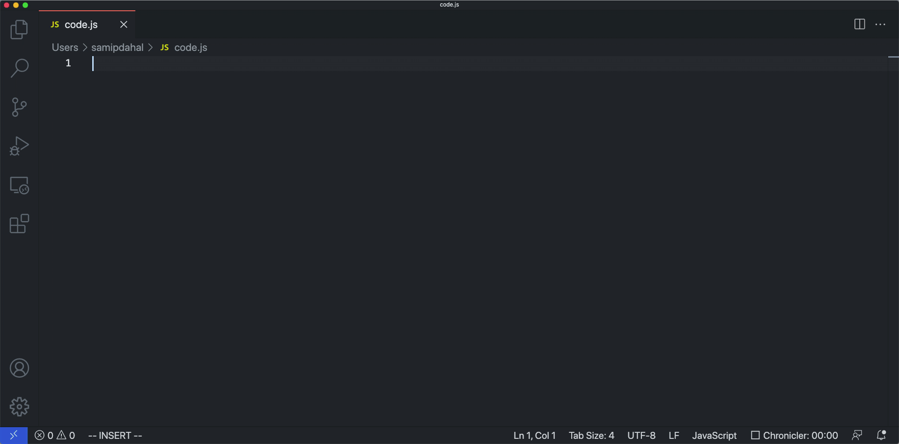

# Codeon

Code generation and code search for Python and Javascript. 

Similar to [GitHub Copilot](https://copilot.github.com/) with one major difference: Code search is leveraged to make up for smaller models and less data. The generation model makes use of search results along with code context to generate contextual code. Moreover, code search results from all over GitHub are displayed in a seperate file along with the exact url of the source code. 


### VSCode extention:
https://marketplace.visualstudio.com/items?itemName=samipdahal.codeon


### Code Generation:

Currently, [GPT-Neo-125M model](https://huggingface.co/EleutherAI/gpt-neo-125M) is used for generation.

Training code is under 'gen' directory.




### Code Search:

[Codebert-base model](https://huggingface.co/microsoft/codebert-base) is used for code search, along with nearest neighbor approximation algorithm [ScaNN](https://github.com/google-research/google-research/tree/master/scann). [CodeSearchNet](https://github.com/github/CodeSearchNet) dataset is used as codebase to search over.

Code to finetune the model and setup ScaNN is under 'search' directory.


## Usage:
### Python:

#YOUR_QUERY.

### Javascript:

//YOUR_QUERY.

(Note the dot ‘.’ at the end.)

## Example:
### Python:

```cpp
# concat two dicts.
```

### Javascript:

```cpp
// merge two arrays.
```

## Notes:

1. The extension only supports python and javascript as of now and won't run on files not ending with '.py' or '.js'

## Requirements
VSCode 1.59.0 or up.

## Feedback/Contact:

If you spot any mistakes or any possible improvements, please feel free to let me know and contributions are welcome!

[Form](https://forms.gle/urfKTGLcLrSnEdLG9) or sdpmas@live.unc.edu

### Some of the code are adapted from following repositories:
1. [CodeSearchNet](https://github.com/github/CodeSearchNet)
1. [CodeXGLUE](https://github.com/microsoft/CodeXGLUE)
1. [APPS](https://github.com/hendrycks/apps)


-----------------------------------------------------------------------------------------------------------

